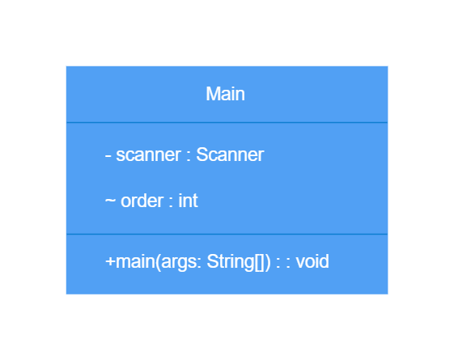

# 키오스크 프로젝트

Java를 사용하여 키오스크를 구현  
단계별 요구사항에 따라 진행하며 구현

## 기능

### Lv 1. 기본적인 키오스크를 프로그래밍

1. **메뉴 출력**
    - 실행 시 메뉴 표시

2. **정수 입력 받기**
    - `Scanner`를 통해 입력 받음
    - 메뉴에 있는 숫자가 아닐 시 예외 처리
    - 음수 입력 예외 처리
    - 숫자 제외 다른 값 예외 처리

3. **입력 받은 값에 따라 주문**

4. **반복문을 이용하여 지속되게 반복**

5. **0 입력시 프로그램 종료**
    - 주문 후 '0' 문자 입력 전까지 반복

- 구조

```text
/Kiosk
    └── level1
            └── Main.java
```

- UML



### Lv 2. 객체 지향 설계를 적용해 햄버거 메뉴를 클래스로 관리하기

1. **MenuItem 클래스 생성**
   - 메뉴의 이름, 가격, 설명 필드를 가짐
   - 설명 : 개별 음식 항목을 관리하는 클래스, 현재는 햄버거만 관리

2. **MenuItem 클래스를 활용하여 메뉴 출력**
   - `MenuItem` 객체 생성을 통해 이름, 가격, 설명을 세팅
   - `List` 를 선언하여 여러 `MenuItem` 추가
   - 반복문을 활용해 `menuItems`를 탐색하면서 하나씩 접근

- 구조

```text
/Kiosk
    └── level2
            ├── Main.java
            └── MenuItem.java
```

### Lv 3. 객체 지향 설계를 적용해 순서 제어를 클래스로 관리하기

1. **Kiosk 클래스 생성**
   - 설명: 키오스크 프로그램의 메뉴를 관리하고 사용자 입력을 처리하는 클래스
   - `MenuItem`을 관리하는 리스트가 필드로 존재
   - `main`함수에서 관리하던 입력과 반복문 로직은 이제 `start`함수를 만들어 관리
   - `List<MenuItem> menuItems`는 `Kiosk` 클래스 생성자를 통해 값을 할당

```text
/Kiosk
    └── level3
            ├── Main.java
            ├── MenuItem.java
            └── Kiosk.java
```

### Lv 4. 객체 지향 설계를 적용해 음식 메뉴와 주문 내역을 클래스 기반으로 관리하기

1. **Menu 클래스 생성**
   - 설명 : MenuItem 클래스를 관리하는 클래스
   - List<MenuItem> 은 Kiosk 클래스가 관리하기에 적절하지 않으므로 Menu 클래스가 관리하도록 변경
   - 카테고리 이름 필드를 가짐
   - 메뉴 카테고리 이름을 반환하는 메서드가 구현 되어야 함

```text
/Kiosk
    └── level4
            ├── Main.java
            ├── MenuItem.java
            ├── Kiosk.java
            └── Menu.java
```

### Lv 5. 캡슐화 적용하기

1. **MenuItem, Menu 그리고 Kiosk 클래스의 필드에 직접 접근하지 못하도록 설정합니다.**

2. **Getter & Setter 메서드를 사용해 데이터를 관리**

```text
/Kiosk
    └── level5
            ├── Main.java
            ├── MenuItem.java
            ├── Kiosk.java
            └── Menu.java
```

### 도전 Lv 1 (Lv 6). 장바구니 및 구매하기 기능을 추가하기

1. **장바구니 생성 및 관리 기능**
   - 사용자가 선택한 메뉴 추가
   - 메뉴 정보 저장

2. **장바구니 출력 및 금액 계산**
   - 결제 전 장바구니에 담긴 모든 메뉴 & 가격 출력

3. **장바구니 담기 기능**
   - 메뉴를 클릭하면 장바구니에 추가할지 여부 확인

4. **주문 기능**
   - 장바구니에 담긴 모든 항목을 출력
   - 금액 계산 및 주문하기를 누르면 장바구니 초기화

```text
/Kiosk
    └── level6
            ├── Main.java
            ├── MenuItem.java
            ├── Kiosk.java
            └── Menu.java
```